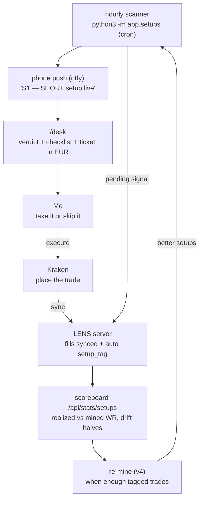

# LENS

**A personal cockpit for trading BTC perpetual futures with discipline.**

LENS runs locally on a miniPC (FastAPI + SQLite, no cloud) and you open it in a
browser. Nothing here trades for you — it's a thinking/measuring tool. You place
the trades on Kraken yourself.

It started as a "hold winners to 4R" discipline tool. Then we mined the actual
trade history (464 closed Kraken trades) and the data said something different —
so LENS now has a primary, evidence-based job and a secondary, still-unproven one:

1. **Trade the mapped edge (LENS_EDGE_v3)** — five setups and seven vetoes mined
   from the real fills, run as a live loop: hourly scanner → phone alert →
   `/desk` checklist → trade on Kraken → auto-tagged on sync → per-setup
   scoreboard → re-mine when enough data accumulates.
2. **The 4H/4R thesis (legacy track)** — plan/projection tooling for the
   "risk 10% to make 40%" idea. Still unproven; kept and clearly labelled.

---

## What the data actually said (LENS_EDGE_v3, 2026-06-12)

Mined from 464 real trades (41.8% WR, €+736) with outlier-trimming and
old-half/new-half robustness checks. Full detail:
`strategies/LENS_EDGE_v3_ICT/FINDINGS.md`.

**You are a momentum-continuation trader, not a reversal trader.**
Trading *with* a liquidity sweep: 50% WR, €+15/trade. Fading the sweep
(classic ICT turtle-soup): 33% WR. Displacement with you: 55%. Against: 35%.

**Five setups that survived everything** (realized/mined WR):

| ID | Setup | Direction | WR |
|---|---|---|---|
| S1 | NY AM killzone flush — RSI<40 + 3 bear bars, 13–16 UTC | short | 90.9% (n=11 tagged) |
| S2 | Premium of 7d range + bearish displacement | short | 65% |
| S3 | RSI>55 + buyside sweep (continuation) | long | 56.7% (n=30) |
| S4 | RSI<40 in discount, no recent sweep | long | 62% |
| S5 | RSI>55 in London killzone 07–10 UTC | long | 60% |

**Seven vetoes — where the account bleeds** (302 of 464 trades, −€1,760):
RSI 40–55 dead zone · 1h EMA21 slope against · fading a sweep · fading a
prior-day-level raid · displacement against · entering inside an FVG retrace ·
NY PM 18–21 UTC.

**Timeframe, settled by the fills:** 1H context, winners resolve in 2–8h
(+€1,552 at 50% WR). Sub-2h trades — over half of everything — bled −€747 at
34–35%. Not a 1m/5m scalper, not (yet) a 4H swing trader.

**The honest caveat that defines the whole design:** mechanically (take every
occurrence, no judgment) every setup is a coin flip at the realized
0.63% SL / 0.95% TP geometry. The 57–91% realized WR came from *discretionary
selection inside these contexts*. So LENS alerts and checklists — it never
auto-enters. Off-playbook trades ("NONE" tag) look profitable only because of
5 outlier wins; without them they're −€736.

---

## The loop (how it actually helps on a live trade)



Every signal — taken or skipped — lands in the `/signals` approve/reject flow
with discipline filters (no Saturday, bleed hours, cooldown). Every synced trade
gets a `setup_tag`. That tagged dataset is what v4 will mine — including new
feature candidates (order flow: CVD, delta, funding, open interest).

---

## The pages

Start the server (below), then visit **http://localhost:8765**.
Nav: **Dashboard · Desk · Signals · Projection · Backtest · Review · Monte Carlo**.

### `/desk` — **the live one. "Can I enter right now?"**
Per-direction verdict (ENTER / BLOCKED / STAND DOWN) with the active vetoes
spelled out, live S1–S5 condition checklists (✓/✗ per condition), and an
always-on trade ticket in money: entry/stop/target, position size from your
risk €, margin at 10x, and the three outcomes — if target / if +0.7% early
exit / if stopped (as % of account). Refreshes every 60s.

### `/signals` — approve/reject queue
Scanner-emitted (and Pine-webhook) signals land here as pending. Decisions and
rejection reasons are stored — skipped signals are data too.

### `/review` — replay real trades on an ICT-style chart
Every closed fill with its entry context computed. Where v1→v3 came from.

### `/` Dashboard + `/projection` — the 4R planning track (legacy)
Goal-first ("what does each trade need to do?") and parameter-first ("where do
locked params land?") calculators with percentile bands, fee-honest R, ruin %.

### `/backtest` + `/montecarlo` — pressure-testing
Backtest engine over cached OHLCV (includes `LIVE_SCALP_v1`, a baseline that
reproduces the realized ~42% WR from pure SL/TP geometry — the bar any
strategy must beat). Monte Carlo can seed its inputs from live trades or any
backtest strategy.

---

## Strategies (the TradingView side)

`strategies/` holds Pine Script. Load in TradingView → Pine Editor.

- **`LENS_EDGE_v3_ICT/indicator.pine`** — **the current one.** Not a strategy:
  a HUD. S1–S5 markers, veto background shading, ghost-marks where a setup
  fired but was vetoed, live checklist table, per-setup alerts.
- `LENS_EDGE_v2/` — the flush short + the mechanical-validation failure that
  taught us setups are contexts, not triggers. Kept for the paper trail.
- `TREND_4R_v1/` — the 4H/4R thesis strategy. Still not validated.
- Older experiments (`PULLBACK_*`, `MOM_BREAK_v1`, …) — see `strategies/README.md`.

---

## Running it

```bash
./start.sh     # starts the server, prints the dashboard link
./stop.sh      # stops it
```

First-time setup:

```bash
pip install -r requirements.txt
cp prism.env .env       # exchange keys etc.
```

**Enable the loop (two one-time steps):**

```bash
# 1. schedule the hourly scanner (minute 2, right after the 1H bar closes)
(crontab -l 2>/dev/null; echo '2 * * * * cd /home/mini/lens && /home/mini/prism/.venv/bin/python3 -m app.setups >> setup_scan.log 2>&1') | crontab -

# 2. phone alerts: install the ntfy app, subscribe to a topic you invent,
#    then add it to prism.env:
echo 'LENS_NTFY_TOPIC=your-secret-topic-name' >> prism.env
```

Health check: `curl localhost:8765/health` · API docs: http://localhost:8765/docs

Useful API: `POST /api/setups/scan` (scan now) ·
`GET /api/setups/state` (desk JSON) · `GET /api/stats/setups` (scoreboard) ·
`POST /api/setups/backfill-tags` (re-tag trades).

---

## Status / honesty

- ✅ v3 edge mapped and live: setup engine, /desk, phone alerts, auto-tagging,
  scoreboard. All 464 historical trades tagged.
- ✅ Exchange sync, signal ingestion, discipline filters, projection/goal math.
- ⏳ Loop needs the crontab line + ntfy topic installed (user-side, above).
- ⏳ v4 needs ~3 months of tagged trades; candidate new features: order-flow
  data (CVD, delta, funding, OI).
- 🧪 `TREND_4R_v1` (4H/4R thesis) — still not backtested; separate track.
- ⚠️ Setup WRs are realized-history numbers, not promises. Mechanical
  occurrence of any setup is ~coin-flip — the edge is selection inside the
  context. Funding cost on multi-day holds is not modelled.

Current progress snapshot: **`STATUS.md`** (read first). Full playbook:
`strategies/LENS_EDGE_v3_ICT/FINDINGS.md`. Build plan history: `LENS_PLAN.md`,
`PRISM-SYSTEM-SPEC (1).md`.

## Working across machines

Active line is **`master`** (the old `lens-4r-projection` branch was merged).

```bash
git pull                              # pick up where you left off
git add -A && git commit -m "..." && git push
```
