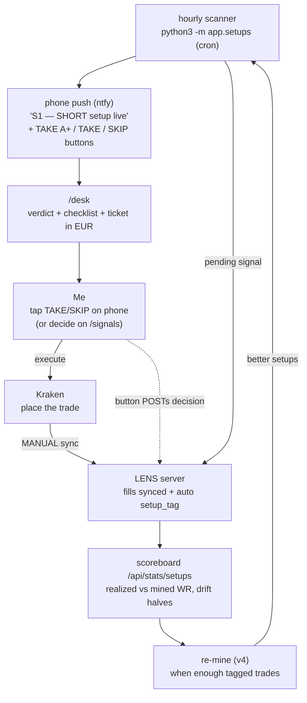

# LENS

**A personal cockpit for trading BTC perpetual futures with discipline.**

LENS runs locally on a miniPC (FastAPI + SQLite, no cloud) and you open it in a
browser. Nothing here trades for you — it's a thinking/measuring tool. You place
the trades on Kraken yourself.

It started as a "hold winners to 4R" discipline tool. Then we mined the actual
trade history (464 closed Kraken trades) and the data said something different —
so LENS now has a primary, evidence-based job and a secondary, still-unproven one:

1. **Trade the mapped edge (LENS_EDGE_v3)** — five setups and seven vetoes mined
   from the real fills, run as a live loop: hourly scanner → phone alert →
   `/desk` checklist → trade on Kraken → auto-tagged on sync → per-setup
   scoreboard → re-mine when enough data accumulates.
2. **The 4H/4R thesis (legacy track)** — plan/projection tooling for the
   "risk 10% to make 40%" idea. Still unproven; kept and clearly labelled.

---

## What the data actually said (LENS_EDGE_v3, 2026-06-12)

Mined from 464 real trades (41.8% WR, €+736) with outlier-trimming and
old-half/new-half robustness checks. Full detail:
`strategies/LENS_EDGE_v3_ICT/FINDINGS.md`.

**You are a momentum-continuation trader, not a reversal trader.**
Trading *with* a liquidity sweep: 50% WR, €+15/trade. Fading the sweep
(classic ICT turtle-soup): 33% WR. Displacement with you: 55%. Against: 35%.

**Five setups that survived everything** (realized/mined WR):

| ID | Setup | Direction | WR |
|---|---|---|---|
| S1 | NY AM killzone flush — RSI<40 + 3 bear bars, 13–16 UTC | short | 90.9% (n=11 tagged) |
| S2 | Premium of 7d range + bearish displacement | short | 65% |
| S3 | RSI>55 + buyside sweep (continuation) | long | 56.7% (n=30) |
| S4 | RSI<40 in discount, no recent sweep | long | 62% |
| S5 | RSI>55 in London killzone 07–10 UTC | long | 60% |

**Seven vetoes — where the account bleeds** (302 of 464 trades, −€1,760):
RSI 40–55 dead zone · 1h EMA21 slope against · fading a sweep · fading a
prior-day-level raid · displacement against · entering inside an FVG retrace ·
NY PM 18–21 UTC.

**Timeframe, settled by the fills:** 1H context, winners resolve in 2–8h
(+€1,552 at 50% WR). Sub-2h trades — over half of everything — bled −€747 at
34–35%. Not a 1m/5m scalper, not (yet) a 4H swing trader.

**The honest caveat that defines the whole design:** mechanically (take every
occurrence, no judgment) every setup is a coin flip at the realized
0.63% SL / 0.95% TP geometry. The 57–91% realized WR came from *discretionary
selection inside these contexts*. So LENS alerts and checklists — it never
auto-enters. Off-playbook trades ("NONE" tag) look profitable only because of
5 outlier wins; without them they're −€736.

---

## The loop (how it actually helps on a live trade)



**Decide from the phone (no app-switch).** Each ntfy push carries three HTTP
action buttons — **TAKE A+** (approve, conviction 5), **TAKE** (approve,
conviction 3), **SKIP** (reject) — that POST straight to
`/api/signals/{id}/decide`. The *phone's* ntfy app makes that request, so the
LENS server must be reachable from the phone: works on home wifi (LAN), needs a
public tunnel on mobile data. Target URL is `LENS_BASE_URL` (see *Running it*).

**The one manual step:** the hourly cron does **not** pull your fills from
Kraken — `run_scan_cli` only scans, emits, notifies, and tags *already-synced*
untagged trades. After you place a trade you must run a Kraken sync
(`POST /api/sync/kraken`, or just open the dashboard) for the fill to land in
the DB and get its `setup_tag`. Automate it with the optional sync cron below.

Every signal — taken or skipped — lands in the `/signals` approve/reject flow
with discipline filters (no Saturday, bleed hours, cooldown). Every synced trade
gets a `setup_tag`. That tagged dataset is what v4 will mine — including new
feature candidates (order flow: CVD, delta, funding, open interest).

---

## The pages

Start the server (below), then visit **http://localhost:8765**.
Nav: **Desk · Signals · Dashboard · Review · Projection · Backtest · Monte Carlo · Prop · Style**.

### Web UI / design system (2026-06)

A shared, responsive **design system** lives in **`app/theme.py`** — the single
source of truth for the whole app:

- **`LENS_CSS`** — the dark "cockpit / HUD" theme. Design tokens (surfaces, text,
  accent + status colors, radii, glow elevation), the type system (Chakra Petch
  display + JetBrains Mono data), every component class, and responsive rules at
  680px / 1080px. Served **once** at `/assets/lens.css` and `<link>`ed by every
  page, so the browser caches it and there is exactly one place to change styling.
- **`shell(path, label, body, *, script, head_extra, meta)`** — the page
  template. Wraps any body in the standard head (fonts + favicon + css), the
  sticky top bar, and the scroll-chip nav (driven by the one `NAV` list, current
  page auto-highlighted). Page-specific CSS goes in `head_extra`; JS in `script`.
- **`FAVICON_SVG`** — the brand mark (a scope / aperture iris; LENS = optics),
  served at `/assets/favicon.svg`.
- **`NAV`** — add a page here once and it appears in every nav bar.

**To add a page:** `from .theme import shell` → build `body` (+ optional
`head_extra` CSS that aliases local var names onto shared tokens, e.g.
`--ac:var(--accent)`) → `return shell("/x", "X", body, ...)`. To restyle the
**entire** app, edit `LENS_CSS` once.

- **`/style`** — **living style guide.** Renders every token + component straight
  from `lens.css`, so it's both the design docs and a visual regression check.
  See also **`BRAND.md`** (logo, voice, palette in one page).
- **On `shell()`:** `/desk`, `/signals`, `/`, `/projection`, `/backtest`,
  `/montecarlo`, `/prop`, `/style` — all share the bar/nav and carry a
  collapsible "❔ how to read this …" explainer.
- **Recolor exception:** `/review` keeps its bespoke full-viewport 3-pane chart
  workstation layout (doesn't fit the scrolling shell), but uses the shared
  palette + fonts.
- **Compare routes** (throwaway, delete on signoff): `/desk-old`, `/signals-classic`.

Built phone-first — open it on the iPhone (Safari → Add to Home Screen for a
fullscreen app feel), it reflows for iPad / desktop.

### `/desk` — **the live one. "Can I enter right now?"**
Per-direction verdict (ENTER / BLOCKED / STAND DOWN) with the active vetoes
spelled out, live S1–S5 condition checklists (✓/✗ per condition), and an
always-on trade ticket in money: entry/stop/target/R:R, position size from your
risk €, margin at 10x, and the three outcomes — if target / if +0.7% early
exit / if stopped (as % of account). A collapsible **"how to read this desk"**
panel explains it in plain English. When a signal is pending, a thumb-zone
**TAKE A+ / TAKE / SKIP** bar decides it in place. Refreshes every 60s.

### `/signals` — approve/reject queue
Scanner-emitted (and Pine-webhook) signals land here as pending, each with
inline **TAKE A+ (conv 5) / TAKE (conv 3) / SKIP** buttons (same decision path
as the desk + the ntfy phone alert → `POST /api/signals/{id}/decide`).
Decisions, conviction, and rejection reasons are stored — skipped signals are
data too. Recent decisions listed below the queue.

### `/review` — replay real trades on an ICT-style chart
Every closed fill with its entry context computed. Where v1→v3 came from.

### `/` Dashboard + `/projection` — the 4R planning track (legacy)
Goal-first ("what does each trade need to do?") and parameter-first ("where do
locked params land?") calculators with percentile bands, fee-honest R, ruin %.

### `/backtest` + `/montecarlo` — pressure-testing
Backtest engine over cached OHLCV (includes `LIVE_SCALP_v1`, a baseline that
reproduces the realized ~42% WR from pure SL/TP geometry — the bar any
strategy must beat). Monte Carlo can seed its inputs from live trades or any
backtest strategy.

### `/prop` — Kraken Prop (Breakout) eval planner
Live Monte Carlo of evaluation paths against the floor/target walls, with the
locked plan, the speed↔probability frontier, and funded-income tables. See the
**Prop track** section below.

### `/style` — living style guide
Every design token + component rendered straight from `lens.css` — the design
docs and a visual regression check in one page. Brand/logo/voice, the full
colour palette, type scale, spacing, and all components. Written companion:
**`BRAND.md`**.

---

## Prop track — Kraken Prop Trading (via Breakout) ✅ BUILT

A **separate system** from the hedge-fund thesis above. LENS-proper maximises
compounding on your own money (risk 10%/trade for 40%). A prop eval is the
opposite game: **survive hard equity walls to a modest target.** Risk 10%/trade
and one stop blows the whole eval. So the prop track has its own objective
function — **pass-probability, not expectancy** — and its own simulator + page.

Firm: **Breakout** (the prop firm Kraken acquired Sept 2025). Funds you up to
**$200,000**. Rules verified June 2026 across 3 review sources (see plan doc).

### What's built (`/prop` page + `app/prop_eval.py`)

- **Eval rules engine** — `EVALS` dict: Breakout 1-Step Classic / Pro / Turbo +
  2-Step, with each firm's daily-loss / max-drawdown / target / leverage cap.
- **Eval simulator** — replays any LENS strategy at *legal* sizing under the
  walls, returns PASS / FAIL. `simulate_eval()` (one historical path) +
  `monte_carlo_eval()` (bootstrapped pass-rate).
- **Portfolio sim** — `monte_carlo_portfolio()` runs a basket on one account.
- **Full sweep** — `python3 -m app.prop_eval sweep` ranks every strategy × risk
  level by pass% and est. months to pass.
- **`/prop` page** — live Monte Carlo of eval paths against the floor/target
  walls (green=pass, red=bust), $5k/$200k + 1/1.5/2% toggles, plus the written
  plan, the speed↔probability frontier, and the funded-income tables.

### Breakout 1-Step Classic rules (the constraint layer)

| | Value |
|---|---|
| Profit target | **10%** |
| Max drawdown | **6% STATIC** — locked to start balance, does NOT trail |
| Daily loss | **3%**, resets 00:30 UTC off prior day's close |
| Leverage cap | 5x · Time limit | none known (confirm) |

Static drawdown on $5k → floor **$4,700, fixed forever**. Profit only adds
cushion (rare among firms — most trail and punish pullbacks). Two kill
conditions: touch the floor ever, OR lose 3% in one day.

### The locked plan

> **`ASIAN_RSI_DIP_v1`** — 4H chart, Asian killzone (00:00+04:00 UTC), 1% stop /
> 4% TP (4R).
> - **Eval phase: 2% risk (2x lev) → ~70% pass in ~2 months** (best of a
>   25-strategy × 5-risk sweep). Cheap retries make expected time ~3mo / ~$29.
>   *(Note: ~70% is the closed-PnL sim. Under the newer **open-equity** check it's
>   **~57%** — still passable, but re-run the sweep to confirm this is still the
>   best pick. See Next, below.)*
> - **Funded phase: drop to 1% risk** for survival and payout longevity.
> - **Size-independent** — same odds on $5k and $200k. Pass the cheap $5k first,
>   then buy the biggest eval directly; **don't ladder** 5k→25k→100k→200k.

The speed↔probability frontier (the hard law the sweep proved):

| Pass within | Best pass% | Config |
|---|---|---|
| 1 month | 45% | coin flip — reject |
| **2 months** | **70%** | **ASIAN_RSI_DIP_v1 @2%** |
| 9 months | 91% | ASIAN_RSI_DIP_v1 @0.75% |

No high-probability sub-month pass exists — BTC mean-reversion lacks that edge.
Stacking strategies for more trades was tested and **rejected** (dilutes WR,
craters pass). For an eval, **quality > quantity** — same conclusion as the edge map.

Mechanic at 2% on $5k: WR 40%, win +7.4%/+$370, loss −2.6%/−$130, ~1.5 trades/mo.
You only fail on a **cold 3-loss start (~22%)**; one win → the static-floor
cushion carries it home. Funded $200k earns ~$3.4k/mo @2% (lumpy) or ~$1.7k @1%.

### Steps taken
1. Verified Breakout rules (static 6% DD, 3% daily, 10% target).
2. Built eval simulator + `/prop` page; proved the 10x hedge-fund thesis busts
   the eval (19% pass) → confirmed the need for a separate system.
3. Swept 25 strategies × 5 risk levels → locked `ASIAN_RSI_DIP_v1 @2%`.
4. Mapped funded income + the 2%-pass / 1%-funded split + direct-scale plan.

### Next (later)
- [ ] Confirm in Breakout dashboard: **time limit, exact fees, $200k eval cost.**
- [ ] **Forward-test** ASIAN_RSI_DIP_v1 @2% on demo before paying the $20.
- [x] Harden the sim: **open-equity (intra-trade) drawdown** added (`open_equity=True`,
      default on in `app/prop_eval.py`). Each trade now tests its worst adverse
      excursion (a full move to the price stop) against the floor + daily wall
      *before* the closed result — Breakout checks live equity, so an eventual
      winner can still bust mid-trade. **Impact: locked plan drops 69.6% → 57.2%
      pass** (the old closed-PnL number was optimistic by ~12pts, not "a few").
- [ ] **Re-run the full sweep under open-equity** — the ~70% locked-plan pick was
      made on the optimistic sim; the strategy × risk ranking may shift now.
      `python3 -m app.prop_eval sweep` (re-pick before paying any eval fee).
- [ ] Long game: lift WR/R via the LENS discretionary edge (real flush WR ~60%
      vs 40% mechanical) → roughly doubles funded income.

Full detail: [`strategies/_prop/BREAKOUT_5K_PLAN.md`](strategies/_prop/BREAKOUT_5K_PLAN.md).

**Sources:** thetrustedprop.com/prop-firms/breakout-prop ·
quantvps.com/blog/breakout-crypto-prop-firm-rules ·
proptradingvibes.com/blog/breakout-faq · **verify on the Breakout dashboard before trading.**

---

## Strategies (the TradingView side)

`strategies/` holds Pine Script. Load in TradingView → Pine Editor.

- **`LENS_EDGE_v3_ICT/indicator.pine`** — **the current one.** Not a strategy:
  a HUD. S1–S5 markers, veto background shading, ghost-marks where a setup
  fired but was vetoed, live checklist table, per-setup alerts.
- `LENS_EDGE_v2/` — the flush short + the mechanical-validation failure that
  taught us setups are contexts, not triggers. Kept for the paper trail.
- `TREND_4R_v1/` — the 4H/4R thesis strategy. Still not validated.
- Older experiments (`PULLBACK_*`, `MOM_BREAK_v1`, …) — see `strategies/README.md`.

---

## Running it

```bash
./start.sh     # starts the server, prints the dashboard link
./stop.sh      # stops it
```

First-time setup:

```bash
pip install -r requirements.txt
cp prism.env .env       # exchange keys etc.
```

**Enable the loop (two one-time steps):**

```bash
# 1. schedule the hourly scanner (minute 2, right after the 1H bar closes)
(crontab -l 2>/dev/null; echo '2 * * * * cd /home/mini/lens && /home/mini/prism/.venv/bin/python3 -m app.setups >> setup_scan.log 2>&1') | crontab -

# 2. phone alerts: install the ntfy app, subscribe to a topic you invent,
#    then add it to prism.env:
echo 'LENS_NTFY_TOPIC=your-secret-topic-name' >> prism.env

# 3. (for the TAKE/SKIP buttons) tell the push where the LENS server lives,
#    as seen FROM THE PHONE. LAN address for home wifi; a public tunnel URL
#    if you want the buttons to work on mobile data.
echo 'LENS_BASE_URL=http://192.168.1.47:8765' >> prism.env

# 4. (optional, closes the loop) auto-pull Kraken fills every hour so trades
#    self-tag without you opening the dashboard:
(crontab -l 2>/dev/null; echo '5 * * * * curl -s -X POST http://localhost:8765/api/sync/kraken >/dev/null') | crontab -
```

Health check: `curl localhost:8765/health` · API docs: http://localhost:8765/docs

Useful API: `POST /api/setups/scan` (scan now) ·
`GET /api/setups/state` (desk JSON) · `GET /api/stats/setups` (scoreboard) ·
`POST /api/setups/backfill-tags` (re-tag trades).

---

## Status / honesty

- ✅ v3 edge mapped and live: setup engine, /desk, phone alerts with one-tap
  TAKE/SKIP buttons, auto-tagging, scoreboard. All 464 historical trades tagged.
- ✅ Exchange sync, signal ingestion, discipline filters, projection/goal math.
- ✅ Loop is live: hourly scanner cron installed and firing (first real S1 short
  emitted + pushed 2026-06-16). Decisions post back from the phone buttons.
- ⚠️ Kraken fill sync is **manual** (or the optional hourly sync cron above) —
  the scanner cron does not pull fills itself.
- ⚠️ Phone buttons reach the server over LAN only unless `LENS_BASE_URL` points
  at a public tunnel.
- ⏳ v4 needs ~3 months of tagged trades; candidate new features: order-flow
  data (CVD, delta, funding, OI).
- 🧪 `TREND_4R_v1` (4H/4R thesis) — still not backtested; separate track.
- ⚠️ Setup WRs are realized-history numbers, not promises. Mechanical
  occurrence of any setup is ~coin-flip — the edge is selection inside the
  context. Funding cost on multi-day holds is not modelled.

Current progress snapshot: **`STATUS.md`** (read first). Full playbook:
`strategies/LENS_EDGE_v3_ICT/FINDINGS.md`. Build plan history: `LENS_PLAN.md`,
`PRISM-SYSTEM-SPEC (1).md`.

## Working across machines

Active line is **`master`** (the old `lens-4r-projection` branch was merged).

```bash
git pull                              # pick up where you left off
git add -A && git commit -m "..." && git push
```
