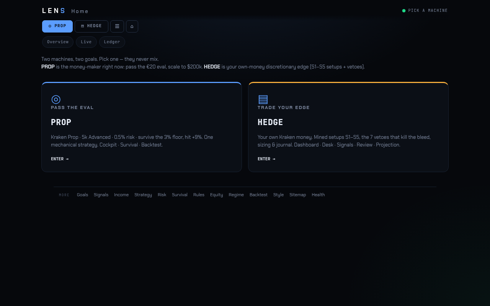
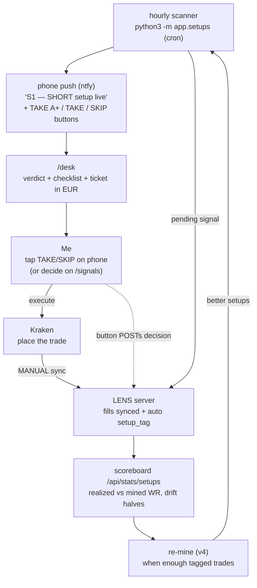
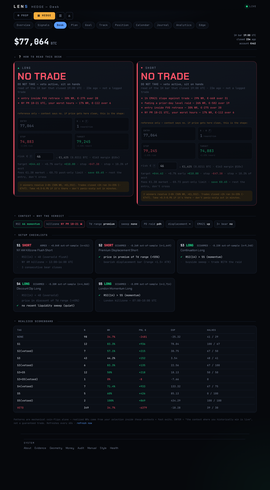

# LENS

**A personal cockpit for trading BTC perpetual futures with discipline.**

LENS runs on the miniPC (FastAPI + SQLite, no cloud dependencies) — open
**https://lens.restedpc.com** from anywhere on the tailnet, or
http://localhost:8765 on the box itself. Nothing here trades for you — it's a
thinking/measuring tool. You place the trades on Kraken yourself.



## At a glance (2026-07-02)

| Piece | State |
|---|---|
| **The loop** (scan → alert → decide → trade → sync → tag) | ✅ live — 4 crons firing, phone buttons work |
| PROP track (eval cockpit, 6 engine pages + live desk/signals/ledger) | ✅ built · eval **not yet bought** |
| HEDGE track (S1–S5 edge, desk/signals/journal/position) | ✅ built |
| Data layer (fills, balances, leverage, equity curve) | ✅ fixed 2026-07-02 — full account-log history, 0 NULL balances |
| Design system (`theme.py`, one CSS, branded 404) | ✅ done |
| Signals / trades through the loop since go-live | 21 signals · **2 of 13 trades via the loop; 11 bypassed it (9 in VETO contexts) ← the actual bottleneck** |
| Strategy audit (geometry + mining, full history) | ✅ 2026-07-02 — `strategies/_research/STRATEGY_AUDIT_20260702.md` |
| v4 re-mine | ⏳ blocked on ~3 months of tagged live trades |

Detailed build history: `LENS_PLAN.md` + `git log`.

It started as a "hold winners to 4R" discipline tool. Then we mined the actual
trade history (464 closed Kraken trades) and the data said something different —
so LENS now has a primary, evidence-based job and a secondary, still-unproven one:

1. **Trade the mapped edge (LENS_EDGE_v3)** — five setups and seven vetoes mined
   from the real fills, run as a live loop: hourly scanner → phone alert →
   `/desk` checklist → trade on Kraken → auto-tagged on sync → per-setup
   scoreboard → re-mine when enough data accumulates.
2. **The 4H/4R thesis (legacy track)** — plan/projection tooling for the
   "risk 10% to make 40%" idea. Still unproven; kept and clearly labelled.

---

## What the data actually said (LENS_EDGE_v3, 2026-06-12)

Mined from 464 real trades (41.8% WR, €+736) with outlier-trimming and
old-half/new-half robustness checks. Full detail:
`strategies/LENS_EDGE_v3_ICT/FINDINGS.md`.

**You are a momentum-continuation trader, not a reversal trader.**
Trading *with* a liquidity sweep: 50% WR, €+15/trade. Fading the sweep
(classic ICT turtle-soup): 33% WR. Displacement with you: 55%. Against: 35%.

**Five setups that survived everything** (realized/mined WR):

| ID | Setup | Direction | WR |
|---|---|---|---|
| S1 | NY AM killzone flush — RSI<40 + 3 bear bars, 13–16 UTC | short | 90.9% (n=11 tagged) |
| S2 | Premium of 7d range + bearish displacement | short | 65% |
| S3 | RSI>55 + buyside sweep (continuation) | long | 56.7% (n=30) |
| S4 | RSI<40 in discount, no recent sweep | long | 62% |
| S5 | RSI>55 in London killzone 07–10 UTC | long | 60% |

**Seven vetoes — where the account bleeds** (302 of 464 trades, −€1,760):
RSI 40–55 dead zone · 1h EMA21 slope against · fading a sweep · fading a
prior-day-level raid · displacement against · entering inside an FVG retrace ·
NY PM 18–21 UTC.

**Timeframe, settled by the fills:** 1H context, winners resolve in 2–8h
(+€1,552 at 50% WR). Sub-2h trades — over half of everything — bled −€747 at
34–35%. Not a 1m/5m scalper, not (yet) a 4H swing trader.

**The honest caveat that defines the whole design:** mechanically (take every
occurrence, no judgment) every setup is a coin flip at the realized
0.63% SL / 0.95% TP geometry. The 57–91% realized WR came from *discretionary
selection inside these contexts*. So LENS alerts and checklists — it never
auto-enters. Off-playbook trades ("NONE" tag) look profitable only because of
5 outlier wins; without them they're −€736.

---

## The loop (how it actually helps on a live trade)



**Decide from the phone (no app-switch).** Each ntfy push carries three HTTP
action buttons — **TAKE A+** (approve, conviction 5), **TAKE** (approve,
conviction 3), **SKIP** (reject) — that POST straight to
`/api/signals/{id}/decide`. The *phone's* ntfy app makes that request, so the
LENS server must be reachable from the phone: works on home wifi (LAN), needs a
public tunnel on mobile data. Target URL is `LENS_BASE_URL` (see *Running it*).

**The alert is a lock-screen ticket (2026-06-21).** The push is deliberately
lean — setup + direction, the three levels (entry / TP / SL with the underlying
move), **win/lose balance**, notional, leverage and account risk — enough to
decide and place the order. The deep breakdown (breakeven, liquidation, Kelly,
geometric drift) lives on `/desk` and the review pages, not the lock screen.
Sizing is tunable in `.env`: `LENS_ACCOUNT_USD`, `LENS_LEVERAGE`,
`LENS_FEE_RT_PCT`. **Both modes alert now:** HEDGE fires hourly (`app.setups`),
PROP fires on Asian-session 4H closes (`app.prop_scan`, 00/04 UTC) — see the
prop track below.

**The one manual step:** the hourly cron does **not** pull your fills from
Kraken — `run_scan_cli` only scans, emits, notifies, and tags *already-synced*
untagged trades. After you place a trade you must run a Kraken sync
(`POST /api/sync/kraken`, or just open the dashboard) for the fill to land in
the DB and get its `setup_tag`. Automate it with the optional sync cron below.

Every signal — taken or skipped — lands in the `/signals` approve/reject flow
with discipline filters (no Saturday, bleed hours, cooldown). Every synced trade
gets a `setup_tag`. That tagged dataset is what v4 will mine — including new
feature candidates (order flow: CVD, delta, funding, open interest).

---

## The pages

Start the server (below), then visit **http://localhost:8765**. The home page
("/") is a **two-door mode chooser** — the app is split into two systems that
never share a nav (2026-06-17):

- **PROP** — pass the Kraken Prop eval. Nav: **Overview · Goals · Live ·
  Signals · Ledger · Income · Strategy · Risk · Survival · Rules · Equity ·
  Regime · Backtest**.
- **HEDGE** — discretionary own-money trading (the S1–S5 edge). Nav:
  **Overview · Dashboard · Goal · Position · Desk · Signals · Calendar ·
  Analytics · Journal · Edge · Board · Learn**.

A `◎ PROP | ▤ HEDGE | ⌂` switch sits above every nav; switching = jumping to
that mode's home (stateless). Each mode shows a few **primary chips** in the
top bar (`PROP_MAIN` / `HEDGE_MAIN` in `theme.py`); the rest drop to a "more"
footer — every page stays reachable either way.

### Web UI / design system (2026-06)

A shared, responsive **design system** lives in **`app/theme.py`** — the single
source of truth for the whole app:

- **`LENS_CSS`** — the dark "cockpit / HUD" theme. Design tokens (surfaces, text,
  accent + status colors, radii, glow elevation), the type system (Chakra Petch
  display + JetBrains Mono data), every component class, and responsive rules at
  680px / 1080px. Served **once** at `/assets/lens.css` and `<link>`ed by every
  page, so the browser caches it and there is exactly one place to change styling.
- **`shell(path, label, body, *, script, head_extra, meta)`** — the page
  template. Wraps any body in the standard head (fonts + favicon + css), the
  sticky top bar, and the **mode-aware** scroll-chip nav + PROP|HEDGE switch
  (current page auto-highlighted). Page-specific CSS goes in `head_extra`; JS in `script`.
- **`FAVICON_SVG`** — the brand mark (a scope / aperture iris; LENS = optics),
  served at `/assets/favicon.svg`.
- **`NAV_PROP` / `NAV_HEDGE`** — two lists, one per mode. `page_mode(path)` maps
  each route to its mode; `nav_html()` renders only that mode's chips. Add a page
  to the right list once and it appears in that mode's nav.

**To add a page:** `from .theme import shell` → build `body` (+ optional
`head_extra` CSS that aliases local var names onto shared tokens, e.g.
`--ac:var(--accent)`) → `return shell("/x", "X", body, ...)`. To restyle the
**entire** app, edit `LENS_CSS` once.

- **`/style`** — **living style guide.** Renders every token + component straight
  from `lens.css`, so it's both the design docs and a visual regression check.
  See also **`BRAND.md`** (logo, voice, palette in one page).
- **On `shell()`:** every page — they all share the bar/nav and most carry a
  collapsible "❔ how to read this …" explainer. Unknown routes get a branded
  404 (same shell; `/api/*` keeps the JSON contract).

Built phone-first (full mobile audit 2026-06-19) — open it on the iPhone
(Safari → Add to Home Screen for a fullscreen app feel), it reflows for
iPad / desktop.



### `/desk` — **the live one. "Can I enter right now?"**
Per-direction verdict (ENTER / BLOCKED / STAND DOWN) with the active vetoes
spelled out, live S1–S5 condition checklists (✓/✗ per condition), and an
always-on trade ticket in money: entry/stop/target/R:R, position size from your
risk €, margin at 10x, and the three outcomes — if target / if +0.7% early
exit / if stopped (as % of account). A collapsible **"how to read this desk"**
panel explains it in plain English. When a signal is pending, a thumb-zone
**TAKE A+ / TAKE / SKIP** bar decides it in place. Refreshes every 60s.

### `/signals` — approve/reject queue
Scanner-emitted (and Pine-webhook) signals land here as pending, each with
inline **TAKE A+ (conv 5) / TAKE (conv 3) / SKIP** buttons (same decision path
as the desk + the ntfy phone alert → `POST /api/signals/{id}/decide`).
Decisions, conviction, and rejection reasons are stored — skipped signals are
data too. Click any **recent decision** to expand its **full order ticket**
(notional, size ₿, margin, win/lose balance, breakeven, liquidation — the same
`_trade_shape` the alert and desk use). The **❔ what is this page** box now
explains **proposed vs decided / who decides** (the scanner proposes; either the
discipline filters auto-reject or *you* decide) and documents every auto-skip
filter (`filter:saturday`, `filter:bleed_hour_*`, `filter:bad_venue_*`,
`filter:cooldown_*`) with the historical loss each is based on.

### `/journal` + `/position` — the live book
The journal absorbed the old `/review` chart workstation (retired in
`b8e6d10`): every closed fill with entry context + **auto-review**, fed by the
`/api/review/*` endpoints. `/position` shows live open positions from the
Kraken sync — the watch-only "what am I holding right now" view.

### `/dashboard` + `/goal` — the 4R planning track (legacy)
Goal-first ("what does each trade need to do?") and parameter-first ("where do
locked params land?") calculators with percentile bands, fee-honest R, ruin %.
`/projection` now redirects to `/goal`.

### `/backtest` — pressure-testing
Backtest engine over cached OHLCV (includes `LIVE_SCALP_v1`, a baseline that
reproduces the realized ~42% WR from pure SL/TP geometry — the bar any
strategy must beat), plus Sharpe/Sortino/Calmar and the SL×TP robustness
heatmap. The standalone `/montecarlo` page was deleted with the old review
workstation; Monte Carlo lives on in `/equity` (prop eval sim).

### PROP mode — the eval cockpit, split into engines
`/prop` is the **Goals hub**: a visual target corridor (floor ── start ──
target) + the 3 structural upgrades, each linking to its engine page. The
engines (all fed by one `prop_views.prop_metrics()` so no two views drift):
**`/strategy`** (WR · R · expectancy R/%), **`/risk`** (risk %/$, stop,
position-size formula, leverage), **`/survival`** (DD limit · max historical DD ·
loss-streak stress table · days-to-breach), **`/rules`** (the live constraint
layer), **`/equity`** (Monte Carlo equity sim from WR+RR — paths, drawdown,
failure frequency), **`/regime`** (BULL/SIDEWAYS/BEAR + hero WR per regime).

The **live + signals + bookkeeping** set (2026-06-19 / -21):
- **`/prop-desk`** (Live) — the prop equivalent of `/desk`: evaluates the hero
  **ASIAN_RSI_DIP_v1** on the freshest closed 4H bar → **ENTER / STAND DOWN**
  (it only fires on the 00/04 UTC Asian closes; a countdown shows the next
  window). Carries the full **trade assumptions** to actually place the order —
  entry, breakeven (after fee), TP, SL, est. liquidation, expected range (ATR),
  notional / margin / size, **long *and* short**, sized at legal prop leverage
  (risk % + maintenance-margin inputs recompute live).
- **`/prop-signals`** (Signals, **2026-06-21**) — the prop review queue, the
  counterpart to `/signals`. The `app.prop_scan` cron reads the same hero on each
  4H Asian close and, on ENTER, inserts a prop signal + pushes a phone alert
  (TAKE/SKIP). Each card shows the prop-legal ticket and a **＋ Log fill to
  ledger** button that writes an *open* `book='prop'` trade carrying
  `linked_signal_id` back to the alert — you close it out (exit + pnl) on the
  ledger. Signal (proposal) and ledger (the equity book of real fills) stay
  separate records, linked; skips never touch the equity curve.
- **`/prop-ledger`** (Ledger) — the prop trade book. Log eval trades by hand
  (`book='prop'`, kept separate from the hedge book) → a running **equity ledger
  vs the walls**: distance to the $4,850 floor, daily-loss used, progress to the
  $5,450 target, plus realised analytics (peak/trough, max DD, current DD, time
  under water, observed loss streak, WR, expectancy, total R). A
  floor ── you ── target corridor moves with each logged trade.
- **`/prop-income`** (Income) — the prop end-goal (separate from the hedge goal):
  a chained **income / FIRE ladder** (rent → salary → company income → trading
  capital/mo → FAT FIRE), anchor-driven (set one rung, the rest derive by fixed
  ratios) with the required **Trading AUM** and a live BTC column.

See the **Prop track** section below.

### `/style` — living style guide
Every design token + component rendered straight from `lens.css` — the design
docs and a visual regression check in one page. Brand/logo/voice, the full
colour palette, type scale, spacing, and all components. Written companion:
**`BRAND.md`**.

---

## Prop track — Kraken Prop Trading (via Breakout) ✅ BUILT

A **separate system** from the hedge-fund thesis above. LENS-proper maximises
compounding on your own money (risk 10%/trade for 40%). A prop eval is the
opposite game: **survive hard equity walls to a modest target.** Risk 10%/trade
and one stop blows the whole eval. So the prop track has its own objective
function — **pass-probability, not expectancy** — and its own simulator + page.

Firm: **Kraken Prop**, powered by **Breakout** (the prop firm Kraken acquired
Sept 2025). Funds you up to **$200,000**. Rules verified live at
**kraken.com/breakout, 2026-06-17.**

### What's built (`/prop` engine pages + `app/prop_eval.py`)

- **Eval rules engine** — `EVALS` dict: Breakout 1-Step Classic / Pro / Turbo +
  2-Step, each with daily-loss / max-drawdown / target / leverage cap **and the
  per-side fee** (`commission_per_side` — the fee is a venue property, so it
  lives on the eval rule and overrides any strategy default).
- **Eval simulator** — replays any LENS strategy at *legal* sizing under the
  walls, **open-equity** (each trade's worst adverse excursion is tested against
  the live walls, not just its closed PnL). `simulate_eval()` + bootstrapped
  `monte_carlo_eval()` + `eval_summary()` (the one source of truth for the pages).
- **Full sweep** — `python3 -m app.prop_eval sweep` (one eval) or `sweep-all`
  (every eval) ranks strategy × risk by pass%.
- **Engine pages** (see PROP mode above) — Goals hub + Strategy / Risk / Survival
  / Rules / Equity / Regime, all fed by `prop_views.prop_metrics()`.
- **Live prop desk** (`app/prop_desk.py`, `/prop-desk`) — evaluates the hero on
  the freshest closed 4H bar → ENTER / STAND DOWN, with the full long/short
  **assumptions block** (entry / breakeven / TP / SL / est. liquidation / expected
  range / notional·margin·size) at legal prop sizing. `GET /api/prop/desk`.
- **Prop trade book** (`app/prop_ledger.py`, `/prop-ledger`) — trades now carry a
  **`book` field** (`'hedge'` default / `'prop'`) so the eval account is separate
  from own-money trades. Log prop fills by hand (`POST /api/prop/trades`) → a
  realised equity ledger vs the walls + DD / streak / time-under-water analytics
  (`GET /api/prop/ledger`). **API sync is a drop-in later** — if Breakout exposes
  Kraken keys, add a 3rd account in `.env` and auto-tag synced fills `book='prop'`.
- **Income / FIRE ladder** (`app/prop_income.py`, `/prop-income`) — the prop
  end-goal: anchor-driven chained ladder (rent → salary → company → trading
  capital → FAT FIRE) + required Trading AUM, EUR + live BTC.

### Verified rules — the constraint layer

Kraken Prop is unusually permissive — the dangerous gotchas **don't exist**:

| | Value |
|---|---|
| Time limit | **NONE** |
| Consistency rule | **NONE** (one big win can't void the eval) |
| Minimum trading days | **NONE** (pass in a single trade) |
| Daily loss | 3%, resets 00:30 UTC |
| Max drawdown | static (does NOT trail) — 6% Starter / 5% Intermediate / **3% Advanced** |
| Profit target | 10% Starter / 12% Intermediate / **9% Advanced** |
| Leverage cap | 5x BTC (2–3x alts) |
| Fees | **0.04%/side** (maker+taker) |
| News / weekend holding | allowed |

Plan ↔ page names: **Starter = `CLASSIC`**, Intermediate = `PRO`,
**Advanced = `TURBO`**. Two kill conditions only, both on **live equity**: touch
the static floor, or lose the daily limit in one day.

### The locked plan (budget-driven: €20 = Advanced)

> **`ASIAN_RSI_DIP_v1`** — 4H, Asian killzone (00:00+04:00 UTC), 1% stop / 4% TP (4R).
> - Eval fees scale with **plan × wallet**. The cheapest eval is the **5k Advanced
>   at €20** (Starter/Classic 5k = $45). With only €20 → **Advanced, one shot, no
>   retry budget** → optimise *single-attempt pass*, not expected-cost-over-retries.
> - **On a 3% static wall, risk % is everything.** Single-shot pass for the hero:

| Risk / trade | Leverage | Pass % | |
|---|---|---|---|
| **0.5%** | 0.5x | **~89%** | **the play** — one loss is tiny, survives a cold start |
| 0.75% | 0.75x | ~74% | faster, still solid |
| 1.0% | 1.0x | ~59% | risky on a 3% wall |
| 2.0% | 2.0x | ~35% | two losses ≈ bust — don't |

> **DECISION: buy the €20 5k Advanced, trade the hero @ 0.5% risk → ~89% one-shot.**
> It's a slow grind (~1.5 trades/mo, no time limit). Ladder up by buying bigger
> Advanced evals **from profit** (200k Advanced = $660). Only a **higher-WR entry**
> lifts the ceiling past 89% — 4R @ 1% stop is already dial-tuned (6R/8R/tighter
> stops all tested worse).

Mechanic at 0.5% on $5k: WR ~41%, win +1.96%, loss −0.54% of account, ~1.5
trades/mo. It takes **~6 losses in a row** to hit the floor (≈4% odds). The
hero's edge is regime-dependent — **BULL ~50% WR vs BEAR ~25%** (see `/regime`),
and with no time limit, waiting for a kinder regime is a free lever.

### Next (later)
- [ ] **Forward-test** ASIAN_RSI_DIP_v1 @ 0.5% on demo before paying the €20.
- [ ] Long game: lift WR via the **HEDGE** discretionary edge (real flush WR ~60%
      vs 40% mechanical) → the only way past the 89% ceiling.

Full detail: [`strategies/_prop/BREAKOUT_5K_PLAN.md`](strategies/_prop/BREAKOUT_5K_PLAN.md).

**Sources:** thetrustedprop.com/prop-firms/breakout-prop ·
quantvps.com/blog/breakout-crypto-prop-firm-rules ·
proptradingvibes.com/blog/breakout-faq · **verify on the Breakout dashboard before trading.**

---

## Strategies (the TradingView side)

`strategies/` holds Pine Script. Load in TradingView → Pine Editor. The
"make it an indicator" plan **was built, not abandoned** — the deliberate
choice was a HUD *indicator* rather than a Pine *strategy*, because the edge
is discretionary selection inside contexts (a mechanical Pine strategy of the
same setups is a coin flip — see the caveat above). The scanner cron is the
server-side twin of the same logic, so the phone alerts work even with
TradingView closed.

- **`LENS_EDGE_v3_ICT/indicator.pine`** — **the current one.** Not a strategy:
  a HUD. S1–S5 markers, veto background shading, ghost-marks where a setup
  fired but was vetoed, live checklist table, per-setup alerts.
- `LENS_EDGE_v2/` — the flush short + the mechanical-validation failure that
  taught us setups are contexts, not triggers. Kept for the paper trail.
- `TREND_4R_v1/` — the 4H/4R thesis strategy. ❌ **Backtested 2026-06-22 →
  20.9% WR, below breakeven, account to zero. Retired** (see its BASELINE.md).
- Older experiments (`PULLBACK_*`, `MOM_BREAK_v1`, …) — see `strategies/README.md`.

---

## Running it

```bash
./start.sh     # starts the server, prints the dashboard link
./stop.sh      # stops it
```

First-time setup:

```bash
pip install -r requirements.txt
# create .env with exchange keys + LENS_* settings (see setups.py header)
```

**The loop crons (all installed and live on the miniPC, 2026-07-02):**

```bash
# hourly HEDGE scanner (minute 2, right after the 1H bar closes)
2 * * * *  cd /home/mini/lens && /home/mini/lens/.venv/bin/python3 -m app.setups >> setup_scan.log 2>&1
# hourly Kraken fill sync (closes the loop — trades self-tag)
5 * * * *  curl -s -X POST http://localhost:8765/api/sync/kraken >/dev/null
# PROP scanner on every 4H close (script gates internally to the Asian 00/04 UTC windows)
5 3,7,11,15,19,23 * * *  cd /home/mini/lens && /home/mini/lens/.venv/bin/python3 -m app.prop_scan >> prop_scan.log 2>&1
# weekly strategy R-sweep re-rank (Mon 04:17)
17 4 * * 1  cd /home/mini/lens && .venv/bin/python3 -m app.strategy_eval >> strategy_eval.log 2>&1
```

Phone alerts need two `.env` values: `LENS_NTFY_TOPIC` (ntfy topic you
invented) and `LENS_BASE_URL` (the server address **as seen from the phone** —
LAN address on home wifi, public tunnel for mobile data — this is what the
TAKE/SKIP buttons POST to).

Health check: `curl localhost:8765/health` · API docs: http://localhost:8765/docs

Useful API: `POST /api/setups/scan` (scan now) ·
`GET /api/setups/state` (desk JSON) · `GET /api/stats/setups` (scoreboard) ·
`POST /api/setups/backfill-tags` (re-tag trades).

---

## Working philosophy — the rule that keeps this from becoming tool-chasing

**Every input becomes a commit or gets discarded — never an open tab.** The
outside world (Twitter frameworks, open-source libs, other people's dashboards)
is raw material; LENS is the filter and the filter is ruthless. Slice the one
good idea *into* the system and throw the rest away. Example — the 2026-07-01
session: a whole folder of quant-Twitter tools came in, and out came
Sharpe/Sortino/Calmar + a native SL×TP robustness heatmap + a regime transition
matrix; everything else (vectorbt, OpenBB, QF-Lib, the funnels) was rejected on
evidence. That's abundance/anti-fragility, not FOMO. The bottleneck was never
missing tools — it's **reps in the journal.** Consistency and commits compound;
FOMO doesn't. This is a craft-persistence project, not a "keep adding surface
area" project.

## TODO — next session (updated 2026-07-04 late)

**A ✅ DONE 2026-07-04** — alerts carry a "⏱ Live now" price+drift line;
pending signals auto-expire when price runs >0.5% past entry (before pushing);
same-idea signals (same direction, entry ±0.5%, approved <6h) auto-approve
quietly — on /signals, no phone buzz. Verified live on a real repeat S3.

**B ✅ DONE 2026-07-04** — one geometry everywhere: `_board_geo` returns
SL_PCT/TP_PCT (0.63/1.5); board picks WHICH strategy, never levels; /desk help
text fixed.

**C. Automated strategy search v2 — BUILT + RUN 2026-07-04**
(`app/strategy_search.py`): ≤3-condition combos across trend/candle/MACD/RSI/
BKK-sessions/Bollinger/TD-Sequential-9/triple-MA-stack/vol-spike/ATR-regime,
real engine + 0.03%/side slippage, split-half filter, SL×TP×lev×ATR-floor
sweep, 7y-binance deep confirmation, Kelly. v2 verdict (2026-07-04): 0
deep-confirmed — but that verdict was scoped to the tight-scalp regime
(stage 1 filtered everything at 0.63/1.5/10x). **SUPERSEDED BY v3.**

**C. Search v3 — dynamic ATR geometry (`app/strategy_search3.py`), RUN
2026-07-04, 43,703 evaluated.** Geometry inside stage 1: stop = k×ATR,
TP = R×stop, risk-normalized 2%/trade (engine: `atr_stop_mult`, `rr`,
`risk_pct`; self-check `test_atr_stop.py`). Four gates: split-half n≥40 →
7×7 (k,R) matrix neighbourhood → 7y deep AT OWN GEOMETRY → **beats
random-entry baseline per-trade on both windows** (gate 4 exists because
buy-every-bar long at 2.5×ATR is itself green on 7y — drift). **VERDICT:
374 distinct survivors clear all four gates** (330 long / 44 short; tight
stops stay dead — fee floor ~0.72R/trade at 0.5% stop vs ~0.1R at 2.5×ATR).
Three families: 4h trend+MACD momentum longs (1.5×ATR, 3–5R, BKK-evening
strongest) · 1h dip-buys in bull structure (RSI≤30/BB<lower + MA-stack
bull, 2.5×ATR, 5R) · SHORT capitulation fades (BB<lower + vol spike —
biggest edge over baseline, +2.08%/trade). Full report (HTML+MD):
Kiki `03 - Resources/lens-strategy-search-v3-202607.*`. Results:
`strategy_search.json` v3. **✅ 2026-07-04: shadow-registered 1 rep per
family** — `TREND_MOMO_VOLSPIKE_v3` / `DIP_BB_MASTACK_v3` /
`CAPITULATION_FADE_SHORT_v3` in `STRATEGIES` (never-alert: setups.py hero
path doesn't iterate the registry; they surface only in the /strategy
dropdown's unranked section, like `ASIAN_MORNING_LONG_v1`). **✅ Pine
exporter speaks `atr_stop_mult`** (k×ATR entry stop, rr×stop TP). Both
covered by `test_atr_stop.py`. NEXT: forward-test ~a month before any
promotion (early Aug 2026); exit-mechanics sims (trailing/BE-move) = next
dimension. Optional: add the three to `strategy_eval.PROP_BACKTEST` if the
scored /strategy board (not just the dropdown) should track them — held off
as premature promotion. Macro feeds / order-flow still need a data source first.

**D ✅ VERIFIED 2026-07-04** — /calendar + /overview-hedge match DB exactly
(484 / −4405.83); /overview prop n=0 correct (book archived 06-30).

**E. One dashboard click (you):** Parameters → rr_ratio (still 4.0 in config;
plan said → 2.4) — decide and click, watch /audit flip the row.

---

## TODO — standing (updated 2026-07-02)

0. **Actually run the loop.** Still the real bottleneck, not code. Signals
   sitting at ~21, trades still not being taken through it — the build is way
   ahead of the usage. Before ANY new surface area: take the next valid S1–S5
   alert on Kraken, let it auto-tag on sync, accumulate tagged live trades toward
   the v4 re-mine (~3 months needed).
1. ~~Strategy R&D session~~ ✅ **DONE 2026-07-02** — full audit at
   `strategies/_research/STRATEGY_AUDIT_20260702.md`. Headlines: S1 is the
   only mechanically-alive labeled setup; the 0.63% stop is right but the
   0.95% target is too tight (real winners run to 1.5-2%); two mined
   candidates (H12 quiet-uptrend grind, H13 weak-bounce fade) now tracked by
   the Monday re-rank — promote to shadow signals only if they hold on fresh
   data for ~a month.

Done 2026-07-02 (see git log for detail):
- Branded 404 page · `/mvp` **dropped** (covered by `/position` +
  `/overview-hedge`; `mvp-executor` branch kept as local archive).
- **Data layer fixed**: balance timeline now reads both cash wallets (account
  is USD-settled; old code filtered to EUR) *and* account-log pagination
  actually works (old cursor bug capped history at 1000 entries). Backfill
  endpoint repaired all 481 closed trades — 0 NULL balances, real leverage.
- README trued up + restructured (at-a-glance table, screenshots, history
  trimmed); `prism.env` retired (everything reads `.env`); orphan pages
  (Style / Sitemap / Health) added to both mode footers.

## Status / honesty

- ✅ v3 edge mapped and live: setup engine, /desk, phone alerts with one-tap
  TAKE/SKIP buttons, auto-tagging, scoreboard. All 464 historical trades tagged.
- ✅ Exchange sync, signal ingestion, discipline filters, projection/goal math.
- ✅ Loop is live: hourly scanner cron installed and firing (first real S1 short
  emitted + pushed 2026-06-16). Decisions post back from the phone buttons.
  Fill sync runs hourly by cron too (the scanner itself never pulls fills).
- ✅ Data layer live (2026-07-02): balances + leverage reconstructed for all
  481 closed trades from the full account log; equity curve / goal model run
  on real data.
- ⚠️ Phone buttons reach the server over LAN only unless `LENS_BASE_URL` points
  at a public tunnel.
- ⏳ v4 needs ~3 months of tagged trades; candidate new features: order-flow
  data (CVD, delta, funding, OI).
- ❌ `TREND_4R_v1` (4H/4R thesis) — **backtested 2026-06-22 → 20.9% WR over 182
  trades, below the 26% fee-adjusted breakeven, PF 0.75, account to zero. RETIRED.**
  The "risk 10% to make 40%" compounding plan rested on a 44–48% WR at 4R that
  the data says doesn't exist. See `strategies/TREND_4R_v1/BASELINE.md`.
- ⚠️ Setup WRs are realized-history numbers, not promises. Mechanical
  occurrence of any setup is ~coin-flip — the edge is selection inside the
  context. Funding cost on multi-day holds is not modelled.

Progress + roadmap live in **`LENS_PLAN.md`** (the single source of truth for
where the build is). Full playbook: `strategies/LENS_EDGE_v3_ICT/FINDINGS.md`.
Original system spec: `PRISM-SYSTEM-SPEC (1).md`.

## Working across machines

Active line is **`master`** (the old `lens-4r-projection` branch was merged).

```bash
git pull                              # pick up where you left off
git add -A && git commit -m "..." && git push
```
