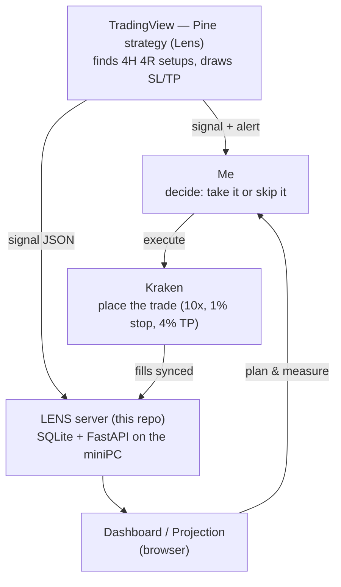

# LENS

**A personal cockpit for trading BTC perpetual futures with discipline.**

LENS exists to fix one specific problem: I take good trades but I close my winners
too early. Historically that turned a real edge into break-even results. LENS is the
toolkit that forces the discipline — find a clean setup, risk a fixed slice of the
account, and **hold the winner all the way to target** instead of bailing.

It runs locally on a miniPC (FastAPI + SQLite, no cloud), and you open it in a
browser. Nothing here trades for you — it's a thinking/measuring tool. You place the
trades on Kraken yourself.

---

## The core idea (the "4R" philosophy)

> **Win rate is not the problem. The exit is.**

The whole strategy in one sentence:

> *I trade BTC perps on Kraken — with the 4H trend — risking a fixed **10% of my
> account to make 40%** (a **4R** trade). My entire edge is holding winners to the
> full target instead of closing early.*

Why this works, in plain terms:

- A **44% win rate is fine.** You don't need to be right more often — that's the hard
  thing to improve and it barely moves the needle.
- What moves everything is **R** — how many multiples of your risk you make on a win.
  Closing at +11% when you risked 10% is ~1R; that's a slow death after fees. Holding
  to +40% is ~4R; that compounds.
- **R is the lever because it's the one you control.** Win rate is a slow byproduct of
  entry quality. R is a *decision you make at the exit* — fixable today.

The honest catch (the reason this isn't just a fantasy spreadsheet): the 4R target
behind a **1% stop** is *unproven*. A 1% stop is tight; it gets wicked by noise, which
can drop the win rate. **Validating that is the job of the backtest** (see Strategies
below). After real fees (0.30% round trip at 10x), the clean "4R" is really **~2.85R** —
LENS shows you the honest number, not the brochure one.

---

## What you actually open (the two pages)

Start the server (below), then visit **http://localhost:8765**.

### 1. `/` — Dashboard (goal-*first*)
Asks: **"What do I *need* each trade to do to hit my goal by a date?"**
You type in a target (e.g. €360 → 1 BTC by December) and it works *backwards* to tell
you the required per-trade growth, R, stop %, and position size, plus Kelly/risk-of-ruin
checks. This is the planning lens.

### 2. `/projection` — Projection (parameter-*first*) — **the newer page**
The exact inverse. Asks: **"My parameters are *locked* (1% stop, 4% TP, 10x) — so
where do I actually *land*?"**
You set the fixed rules and a win rate, and it projects the equity curve *forward*:

- **Coloured percentile bands** (P05 unlucky → median → P95 lucky) week by week.
- **Headline metrics:** EV per trade, real R after fees, weeks-to-double, breakeven
  win rate, risk of ruin.
- **Two sensitivity tables** — turn the win-rate dial vs. turn the R dial — so you can
  *see* why R is the lever you control.
- A **Fee %** field so the costs match your real Kraken fees.

> The page is deliberately honest: far-out totals go to absurd numbers (compounding
> does that) — it tells you to read the *shape and the early weeks*, not the raw totals.

*(Screenshots: drop PNGs into `docs/img/` and they'll show here.)*
<!--  -->
<!--  -->

---

## Strategies (the TradingView side)

LENS doesn't draw charts — TradingView does that far better. The `strategies/` folder
holds **Pine Script** strategies that encode the rules above so you can **backtest them**
in TradingView's Strategy Tester and (later) get phone alerts.

- **`TREND_4R_v1`** — the current one. 4H, with-trend only, fixed 1% stop / 4% TP (4R),
  10x, skip-Saturday + one-trade-per-day discipline. Its `BASELINE.md` explains the
  experiment: *does a 4H signal actually reach 4R behind a 1% stop, and at what real
  win rate?* Fill in the Strategy Tester numbers there.

See `strategies/README.md` for how to load a strategy and set up alerts.

---

## How it fits together



Every signal — *taken or skipped* — is stored with its full feature set and linked to
the real fill. Over ~150–300 trades that becomes a dataset of *(setup → outcome)*, which
is the long-term goal: learn which setups actually reach 4R.

---

## Running it

```bash
./start.sh     # starts the server, prints the dashboard link
./stop.sh      # stops it
```

`start.sh` runs it as a background service and prints:

```
✅ LENS is up. Open the dashboard:
   →  http://localhost:8765
   →  http://192.168.1.114:8765   (from your phone on the same Wi-Fi)
```

First-time setup:

```bash
pip install -r requirements.txt
cp prism.env .env       # exchange keys etc.
```

Health check: `curl localhost:8765/health` · API docs: http://localhost:8765/docs

---

## Working across machines (laptop ↔ miniPC)

Active work lives on the branch **`lens-4r-projection`** (direct pushes to `master`
are blocked by a review guard).

**To pick up where you left off on another machine:**

```bash
git fetch origin
git checkout lens-4r-projection     # first time
# or, if already on the branch:
git pull
```

**To save and sync your work back up:**

```bash
git add -A
git commit -m "what changed"
git push origin HEAD:lens-4r-projection
```

**When the branch is solid and you want it as your main line:**

```bash
git checkout master
git merge lens-4r-projection
```

Current progress snapshot is always in **`STATUS.md`** — read that first to remember
where things stand and what the next step is.

---

## Status / honesty

- ✅ Goal calculator, projection page, exchange sync, signal ingestion, discipline filters.
- 🧪 `TREND_4R_v1` written — **not yet backtested.** The 4R-at-1%-stop premise is the open question.
- ⚠️ Projections are models, not promises. They assume the win rate holds at a tight
  stop and bake in 0.30% round-trip fees — but funding cost on multi-day holds is not
  modelled. Treat the early weeks and the ruin % as the trustworthy parts.

See `LENS_PLAN.md` for the full build plan and `PRISM-SYSTEM-SPEC (1).md` for the
four-component architecture (Core / Lens / Dashboard / Notify).
