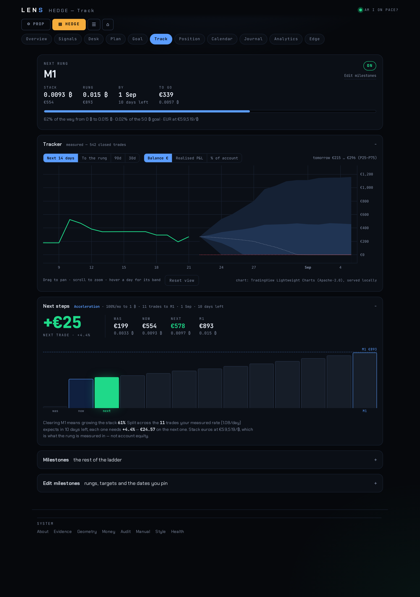

# LENS

[Open as HTML](README.html)

**A cockpit for trading BTC perpetual futures with discipline.**

I trade crypto with my own money. LENS is the system I'm building to help me do
that well — it scans, alerts, checklists, journals, measures, and now places the
order, so the decisions are mine but the record isn't a guess. Slow and steady
wins the race: **150 ₿ by the end of 2028**, with 50 ₿ as the waypoint where the
burn stops being the question, reached one rung at a time rather than one heroic
month.

The money philosophy underneath is FIRE, extended past index funds — bitcoin is
the engine, but the plan only works with an understanding of the other asset
classes around it, a burn rate that's actually known, and income that survives a
bad quarter. That's the whole of personal finance in a paragraph: spend less than
you make, know your number, own assets that compound, and don't blow up.

LENS runs on the miniPC (FastAPI + SQLite, no cloud dependencies) — open
**https://lens.restedpc.com** from the tailnet, or http://localhost:8765 on the
box.


## Two books, one front door

Each has its own nav, ledger and maths:

- **HEDGE** — discretionary own-money trading on the mined edge
  (`LENS_EDGE_v3`: five momentum-continuation setups + seven vetoes, mined
  from the real fill history). Playbook:
  [`strategies/LENS_EDGE_v3_ICT/FINDINGS.md`](strategies/LENS_EDGE_v3_ICT/FINDINGS.md).
- **PROP** — surviving a Breakout (Kraken Prop) evaluation, which is the
  opposite game: pass-probability against equity walls, not expectancy. Its
  own simulator, ledger (`book='prop'`), desk and goal pages.

## The goal, and how it's tracked

**150 ₿ by 2028-12-31**, in three phases rather than one flat rate — because the
rate that clears a small stack costs almost nothing in absolute risk, and the
rate that is survivable on a large one is a different number entirely:

| phase | to | rate/month |
|---|---|---|
| Acceleration | 1 ₿ | 100% |
| Growth | 50 ₿ | 50% |
| Maintenance | 150 ₿ | 10% |

Only 5 of 28 months ever ask for a double, and the last is March 2027. Every rung
is snapped to a number a person actually aims at — `0.015 · 0.03 · 0.05 · 0.1 ·
0.2 · 0.5 · 1 · 1.5 · 2 · 3 · 5 …` — because a rung is something you hold in your
head between now and hitting it, and `0.01489` is not. Rung dates are derived
from where the stack actually is, except where I've pinned one; a pinned date is
never recomputed and the rungs beneath it compress to fit.

`/hedge-track` is the daily surface for that, and it holds three things: the next
rung, the band I should be inside, and what the **next trade** has to make. The
rung divided by the trades left is the only form of the goal that can be acted on
at the moment of an entry — nobody sizes a position against a percentage of a
milestone.



The fan is a Monte-Carlo projection bootstrapped from my own closed trades, not a
tidy Gaussian — so the expectancy and the variance are the ones I really trade.
The red line is the point where the account is gone, and it's drawn on purpose:
a projection that hides its own ruin cases isn't honest.

It pans and zooms (TradingView Lightweight Charts, vendored into `app/vendor/`
rather than pulled from a CDN — a chart that fails to load offline takes the
page's whole answer with it). Four ranges: **Next 14 days** steps per calendar
day from today, for "where should tomorrow land"; the other three step per trade
toward the rung. Upper percentiles are bent toward a €40M ceiling, because P90
in nine figures says nothing except that exponentials are exponential.

The daily discipline score and the signal-adherence count live on
`/hedge-analytics` under **Review** — they answer "how have I been behaving",
which is a question for afterwards, not one to read before an entry. Discipline
there is a gate rather than the heaviest weight: a day with an off-plan trade
scores zero however profitable it was, because what costs me money is frequency
and rule-breaking, not being wrong.

## The loop

Scanner cron → ntfy push with one-tap **TAKE / SKIP** buttons → `/hedge-desk`
checklist → trade on Kraken → hourly sync pulls the fill, auto-tags it and links
it to the signal that caused it → per-setup scoreboard → re-mine when enough
tagged trades accumulate. Signals pass discipline filters (bleed-hour veto,
cooldown) before they reach the phone.

**LENS places HEDGE orders as of 2026-08-20.** Entry plus bracketed TP/SL as
reduce-only triggers, every gate evaluated before anything is sent, nothing sent
without an explicit confirm, and the result verified against the exchange rather
than against the API's own reply. It is not autonomous: I decide, LENS sends.

PROP evaluation trades are still typed by hand — that venue has no API worth
routing through.

"Watch-only honesty" was retired as a design principle deliberately. The ledger
had 147 signals fired against 4 acted on: a decision made twice is a decision
usually not made, and the cost of that gap was larger than the risk the rule was
guarding.


## Where it's going

- **Editing working orders.** `Trade.edit_order` exists on the API and is unwired,
  so moving a stop still means cancel-and-replace or the website.
- **Recording partial exits.** The trim itself works; the *record* does not.
  Fills aggregate into one open→close row, so a partial exit shows only as a
  smaller final size — a decision that leaves no trace.
- **One venue.** Kraken for everything; Bybit comes out. Two price sources in one
  system is two clocks, and a dashboard with two clocks can't be trusted.
- **My vocabulary, not the tool's.** Renaming everything I wouldn't say out loud,
  and deleting what I never use. A cockpit whose labels need translating is one I
  can't fly under pressure.
- **Paper first.** `kraken paper` runs approved tickets against live prices with
  no keys and no money — the cheap way to prove the loop before it holds a real
  credential.

Open items live in [`NEXT_SESSION.md`](NEXT_SESSION.md); shipped history in
[`CHANGELOG.md`](CHANGELOG.md). The v1 build plan is archived at
[`docs/DONE-2026-08-22-lens-plan-v1.md`](docs/DONE-2026-08-22-lens-plan-v1.md).

## Running it

```bash
pip install -r requirements.txt   # first time; then create .env (see app/setups.py header)
./start.sh                        # prints the dashboard link
./stop.sh
```

The crons that keep the loop alive (installed on the miniPC):

```bash
# hourly HEDGE scanner (minute 2, right after the 1H close)
2 * * * *  /home/mini/lens/.venv/bin/python3 -m app.setups >> logs/setup_scan.log 2>&1
# hourly Kraken fill sync (closes the loop — trades self-tag)
5 * * * *  curl -s -X POST http://localhost:8765/api/sync/kraken >/dev/null
# PROP scanner on 4H closes (gates internally to the Asian 00/04 UTC windows)
5 3,7,11,15,19,23 * * *  cd /home/mini/lens && /home/mini/lens/.venv/bin/python3 -m app.prop_scan >> logs/prop_scan.log 2>&1
# weekly strategy R-sweep re-rank (Mon 04:17)
17 4 * * 1  cd /home/mini/lens && .venv/bin/python3 -m app.strategy_eval >> logs/strategy_eval.log 2>&1
```

Phone alerts need `LENS_NTFY_TOPIC` and `LENS_BASE_URL` (the server address
*as seen from the phone* — the TAKE/SKIP buttons POST to it) in `.env`.

Health: `curl localhost:8765/health` · API docs: http://localhost:8765/docs ·
deploy: `systemctl --user restart lens.service`

## Layout

```
app/          the server — FastAPI, pages, engines, scanners
strategies/   Pine strategies, one folder each + BASELINE/FINDINGS
research/     one-off analysis scripts, not wired into the app. They import
              each other by bare name (edge_miner, ict_miner and trade_review
              are one family), so they have to share a directory
tests/        assert-based self-checks
docs/         reference docs, screenshots, and completed build specs
app/vendor/   third-party JS served from /assets, vendored not CDN'd
data/         lens.db — the ledger. The one irreplaceable thing here.
              Gitignored; pre-change snapshots go to tmp/
results/      generated output: searches, breeder runs, dedup clusters.
              strategy_scores.json is the live board cache the app reads
logs/         everything systemd and cron redirect into
```

Every path is defined once in `app/paths.py`, anchored to the repo root via
`__file__` rather than the cwd. That matters more than tidiness: the database
path used to be a bare relative `"lens.db"`, so a script run from the wrong
directory silently opened a **different, empty** database instead of failing.

Reading the docs: **`/manual`** renders README, the plan, the changelog,
PRODUCT and BRAND live from disk, in the app's own theme. (`/docs` is FastAPI's
API reference — different thing, same-sounding name.)

Scripts in `research/` and `tests/` open with `import _bootstrap`, which puts
the repo root on `sys.path` and makes it the cwd — they import `app` and some
open `lens.db` by its bare relative name, which only works from the root.

```bash
.venv/bin/python3 -m pytest tests/ -q
```

## Docs

| File | What |
|---|---|
| `CHANGELOG.md` | Dated build history — what shipped, when, and the gotchas |
| `NEXT_SESSION.md` | Open items, re-verified against the code each session |
| `strategies/LENS_EDGE_v3_ICT/FINDINGS.md` | The mined edge, full detail |
| `PRODUCT.md` / `BRAND.md` / `/style` | Product definition · brand voice · living style guide |
| `strategies/README.md` | Pine Script side (TradingView HUD indicator) |

## Status (2026-08-22)

The loop has been live since 2026-06-16 and, since 2026-08-20, closes all the
way through to a placed order. The build is still ahead of the usage and that is
still deliberate — the bottleneck is reps, not code.

**The number that matters, and it is not a good one.** The ladder needs **+2.14%
per trade** through Acceleration. The ledger says the measured edge is negative:
−0.206 R per trade over 527 trades all-time, −0.260 R over the last 90. No
position size converts a negative expectancy into a positive one; it only changes
how fast it plays out. At the measured 39% win rate it takes roughly **5R** to
clear what the plan asks for, against the 1.32 currently realised — so the lever
is the reward multiple, not the risk amount.

Everything else in this repo is instrumentation. None of it moves that number,
and the instrumentation exists mainly so the number is impossible to look away
from.

Development is on **`master`** — one branch, no ceremony.
